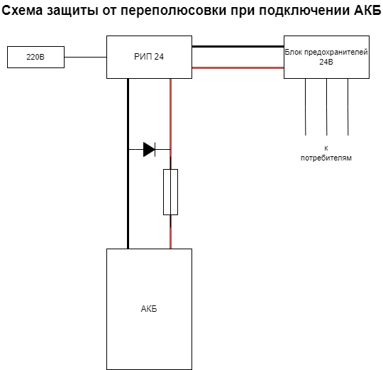

# Модернизация центрального узла связи

## Оглавление:

1. [Описание задачи](#описание-задачи)
2. [Расчеты токов потребления](#расчеты-токов-потребления)
3. [Переход на питание 24 В постоянного тока](#переход-на-питание-24-в-постоянного-тока)
4. [Аккумуляторы и резервное питание](#аккумуляторы-и-резервное-питание)
5. [Установка DC-DC преобразователей](#установка-dc-dc-преобразователей)
6. [Подключение оборудования к шине 24 В](#подключение-оборудования-к-шине-24-в)
7. [Монтаж оборудования в шкаф 42U](#монтаж-оборудования-в-шкаф-42u)
8. [Обеспечение защиты и кабельная разводка](#обеспечение-защиты-и-кабельная-разводка)
9. [Калькуляция необходимого оборудования и материалов](#калькуляция-необходимого-оборудования-и-материалов)
10. [Расположение распределительного устройства и блока предохранителей](#расположение-распределительного-устройства-и-блока-предохранителей)
11. [Расчет сечений проводов и длины кабелей](#расчет-сечений-проводов-и-длины-кабелей)
12. [Примерная стоимость компонентов для модернизации](#примерная-стоимость-компонентов-для-модернизации)
13. [Перечень материалов и оборудования для модернизации узла связи](#перечень-материалов-и-оборудования-для-модернизации-узла-связи)

---

## Описание задачи
Цель проекта — модернизация центрального узла связи для повышения энергоэффективности и автономности.
### Активное оборудование на узле связи:
1. **Сервер Supermicro (процессор Xeon E3-1230 v2)**
   - **Потребляемая мощность**: 80 Вт (в среднем, под 80% нагрузкой)
   - **Питание**: 220 В через ИБП Inelt 500

2. **Коммутатор Eltex MES-2124M**
   - **Потребляемая мощность**: 25 Вт
   - **Питание**: 220 В через ИБП Inelt 500

3. **GPON OLT BDCOM P3310 (4 порта)**
   - **Потребляемая мощность**: 40-50 Вт
   - **Питание**: 220 В через ИБП Inelt 500

4. **Микротик RB4011**
   - **Потребляемая мощность**: 18-20 Вт
   - **Питание**: 220 В через ИБП Inelt 500 (через адаптер)

5. **Ubiquiti (5 устройств)**
   - **Потребляемая мощность**: 5-7 Вт каждое, итого: 25-35 Вт
   - **Питание**: 220 В через ИБП Inelt 500 (через PoE-инжекторы)

6. **TP-Link TL-MR3020**
   - **Потребляемая мощность**: 5 Вт
   - **Питание**: 220 В через ИБП Inelt 500 (через адаптер)
### Текущее состояние питания:
- Все активное оборудование на узле связи сейчас питается через ИБП **Inelt 500**, который преобразует 220 В сети переменного тока в питание для всех устройств.
- При работе от аккумуляторов ИБП, часть энергии теряется при преобразовании 12 В DC (от аккумуляторов ИБП) в 220 В AC, а затем обратно в 12-24 В DC через блоки питания устройств, что снижает общую эффективность системы.

### Общая потребляемая мощность оборудования: 
- Оборудование на узле потребляет около **195-210 Вт**.

### Задача:
Перевести все оборудование на питание **24 В постоянного тока** для повышения эффективности и продления времени автономной работы, исключив потери на преобразование.
При переходе на 24 В с использованием преобразователей и РИПа, потери в импульсных блоках питания (особенно при переходе с 220 В на постоянный ток) будут существенно сокращены.
#### Оценка потерь и тепловыделения:
ИБП (UPS): стандартные ИБП на 220 В обычно имеют КПД около 85-90%, что приводит к потерям порядка 10-15%. При переходе на питание постоянным током через РИП потери могут снизиться до 5-7%.
Импульсные блоки питания 220 В -> 12 В/24 В: Эти блоки заменяются преобразователями постоянного тока, которые, как правило, работают с КПД 90-95%, что также снижает тепловыделение и потери.
Снижение потерь на преобразованиях: Сокращение числа преобразований с 220 В на 12 В/24 В и замена блоков на более эффективные снизит общее тепловыделение и энергопотребление. Ожидаемое снижение потерь может составить около 10-15%.
#### Примерные потери при переходе на постоянный ток
С учетом КПД преобразователей (например, 90-95%) и снижения потерь на ИБП, итоговое энергопотребление всей системы может уменьшиться на 10-15%. Это продлит время автономной работы и снизит тепловыделение на узле связи.
Основная задача — переход с 220 В переменного тока на питание 24 В постоянного тока, что позволит исключить потери энергии при преобразованиях и продлить время работы от аккумуляторов. Все устройства, включая сервер, коммутатор, GPON OLT, MikroTik, и точки доступа Ubiquiti, будут переведены на 24 В.

---
## Расчеты токов потребления

### 1. **Общее потребление узла связи (с учетом всех устройств)**
Теперь пересчитаем общее потребление всех устройств:

1. **Сервер Supermicro с Xeon E3-1230 v2** = **100 Вт**.
2. **Коммутатор Eltex MES2124M** = **20 Вт**.
3. **Ubiquiti (5 штук)** = **50 Вт**.
4. **GPON OLT BDCOM P3310** = **35 Вт**.
5. **MikroTik RB4011** = **25 Вт**.
6. **TP-Link TL-MR3020** = **5 Вт**.

#### Итого:
$$\[
100 + 20 + 50 + 35 + 25 + 5 = 235 \, \text{Вт}
\]$$

### 2. **Расчет тока**
Теперь пересчитаем ток, потребляемый всей системой при питании от 24 В:

$$\[
I = \frac{P}{U} = \frac{235}{24} \approx 9.79 \, \text{А}
\]$$

### 3. **Расчет автономности**
У вас две аккумуляторные батареи по **12 В 125 А·ч**, последовательно соединенные, что эквивалентно **24 В 125 А·ч**. Для расчета времени автономной работы используем формулу:

$$\[
t = \frac{C}{I} = \frac{125}{9.79} \approx 12.77 \, \text{ч}
\]$$

С учетом фактора реальной емкости (например, использования 80% емкости аккумуляторов, чтобы избежать их глубокого разряда):

$$\[
t_{\text{реальное}} = 12.77 \times 0.8 \approx 10.2 \, \text{часов}
\]$$

### 4. **Итоговая автономность**
Общий ток потребления составит около **9.79 А**, что обеспечит время автономной работы около **10.2 часов** с двумя батареями 12 В 125 А·ч, с учетом реальной емкости аккумуляторов.

Если будут резкие пики потребления или другие устройства, время может сократиться, но при стабильной работе эта конфигурация будет держаться чуть больше 10 часов.

---

## Переход на питание 24 В постоянного тока

Для выбора подходящего РИП (резервного источника питания) 24 В от MeanWell, нужно учесть суммарное потребление всех устройств и необходимую мощность для зарядки аккумуляторов.

### Шаги расчета:
1. **Суммарная мощность потребления оборудования.**
   - Сервер Supermicro с Xeon 1230v2: под нагрузкой ~80 Вт.
   - Коммутатор Eltex MES2124M: до 24 Вт.
   - 5 Ubiquiti устройств: по ~8 Вт каждое, суммарно 40 Вт.
   - GPON OLT: ~50 Вт.
   - MikroTik RB4011: ~20-25 Вт.
   - TP-Link TL-MR3020: до 2-3 Вт.

   **Суммарное потребление**:  
   $$\( 80 + 24 + 40 + 50 + 25 + 3 = 222 \text{ Вт} \)$$

2. **КПД преобразователей.**
   - Учитываем КПД преобразователей (например, DC-DC для коммутатора и PicoPSU для сервера) около 90%. Это добавляет потерь около 10%.
   - Корректируем суммарную мощность:  
   $$\( 222 \times 1.1 = 244.2 \text{ Вт} \).$$

3. **Зарядка аккумуляторов.**
   - Для аккумулятора 24 В с емкостью 125 А·ч требуется ток заряда в среднем **0.1С** (10% от емкости), то есть ток 12.5 А. Мощность на зарядку:
   $$\[
   P_{\text{зарядка}} = 24 В \times 12.5 А = 300 \text{ Вт}
   \]$$

4. **Суммарная мощность РИП:**
   - Потребляемая мощность оборудования: **244 Вт**.
   - Мощность на зарядку АКБ: **300 Вт**.
   - Общая мощность, которую должен обеспечить РИП:
   $$\[
   244 \text{ Вт} + 300 \text{ Вт} = 544 \text{ Вт}
   \]$$
   Для запаса берём коэффициент 1.2:
   $$\[
   544 \times 1.2 = 652.8 \text{ Вт} \approx 650 \text{ Вт}.
   \]$$

### Подбор модели MeanWell:
Нам нужен РИП с выходным напряжением 24 В, способный поддерживать мощность около 650 Вт, с функцией заряда аккумуляторов. Рассмотрим серию MeanWell с UPS функцией.

**Подходящие модели:**
1. **MeanWell DRP-960-24**:
   - Выход: 24 В, 40 А (мощность 960 Вт).
   - Это мощное решение, подходящее как для питания оборудования (244 Вт), так и для зарядки АКБ (300 Вт).
   - Есть возможность подключения внешнего аккумулятора для резервирования питания (с UPS функцией).

2. **MeanWell DRS-480-24**:
   - Выход: 24 В, 20 А (мощность 480 Вт).
   - Меньшая мощность, подойдет, если одновременно оборудование не потребляет более 480 Вт. Но для полной зарядки аккумуляторов ток заряда может быть меньше, что увеличит время зарядки.

### Итог:
- **MeanWell DRP-960-24** — наиболее подходящая модель для обеспечения достаточной мощности для всех устройств и быстрой зарядки аккумуляторов.
** Мы выбрали источник бесперебойного питания (РИП) MeanWell DRP-960-24 для питания всех устройств и зарядки аккумуляторов. ** Планируем подключение двух аккумуляторов 12 В (емкостью 125 А·ч) последовательно, чтобы получить 24 В. Это обеспечит питание для всех устройств без необходимости в преобразователях 220 В. Также это позволит повысить КПД системы и продлить время автономной работы.

---

## Аккумуляторы и резервное питание
Для резервного питания будет использоваться два аккумулятора по 12 В, 125 А·ч каждый, соединенных последовательно для обеспечения 24 В. Мы рассчитали, что данная конфигурация сможет обеспечить до 9 часов автономной работы для всех устройств. Установка защитных предохранителей на 80 А на каждую АКБ позволит защитить систему от коротких замыканий при замене батарей.
Для защиты от переполюсовки применяется схема через [диод 250А](https://harat.ru/novocherkassk/products/917200-diod-poluprovodnikoviy-vl200-dlya-elektrovoza/) 

---

## Установка DC-DC преобразователей
Для преобразования напряжения с 24 В до 12 В при мощности до 30 Вт, важно выбрать понижающий преобразователь с максимальным КПД, чтобы минимизировать потери энергии. Рассмотрим несколько моделей понижающих DC-DC преобразователей с высокими показателями эффективности.

### Подходящие модели преобразователей:

1. **MeanWell SD-25A-12**
   - **Мощность**: 25 Вт (выходной ток до 2.1 А).
   - **Входное напряжение**: 19-36 В DC.
   - **Выходное напряжение**: 12 В DC.
   - **КПД**: до 88%.
   - **Размеры**: Компактный размер, легко устанавливается в 19" шкафы.
   - **Примечание**: Идеально подходит для питания оборудования с небольшой нагрузкой до 25 Вт.

2. **DROK DC-DC Buck Converter 24V to 12V**
   - **Мощность**: до 60 Вт (выходной ток до 5 А).
   - **Входное напряжение**: 15-40 В DC.
   - **Выходное напряжение**: 12 В DC.
   - **КПД**: до 96%.
   - **Примечание**: Очень высокое КПД, что помогает минимизировать потери энергии. Отличный вариант для оборудования с мощностью до 30 Вт, есть защита от перегрева и перегрузки.

3. **Victron Orion-Tr 24/12-5A (60 Вт)**
   - **Мощность**: до 60 Вт (выходной ток до 5 А).
   - **Входное напряжение**: 15-40 В DC.
   - **Выходное напряжение**: 12 В DC.
   - **КПД**: до 87%.
   - **Примечание**: Прочный и надежный преобразователь, особенно подходит для использования в условиях, где требуется стабильность и долговечность.

4. **Murata OKI-78SR-12/1.5-W36-C**
   - **Мощность**: до 18 Вт (выходной ток до 1.5 А).
   - **Входное напряжение**: 7-36 В DC.
   - **Выходное напряжение**: 12 В DC.
   - **КПД**: до 90%.
   - **Примечание**: Очень компактный и эффективный преобразователь для маломощных устройств. Подходит для питания небольших коммутаторов или других устройств с низким энергопотреблением.

### Рекомендации:
- **DROK DC-DC Buck Converter** — самый оптимальный выбор для нагрузки до 30 Вт, так как он имеет высокое КПД (до 96%), достаточный запас по мощности и встроенную защиту.
- **MeanWell SD-25A-12** — хороший вариант для устройств с нагрузкой до 25 Вт, если нужен компактный и надежный преобразователь.
Для питания оборудования, требующего 12 В (например, коммутатора Eltex), мы используем высокоэффективные DC-DC преобразователи с 24 В на 12 В. Мы выбрали модель **DROK DC-DC 24В на 12В** с максимальной мощностью 60 Вт и высоким КПД для минимизации потерь энергии.

---

## Подключение оборудования к шине 24 В
К шине 24 В будут подключены сервер через PicoPSU (24 В → ATX), коммутатор через DC-DC преобразователь, MikroTik RB4011 напрямую к 24 В, GPON OLT, Ubiquiti и другие устройства. Все подключения будут защищены предохранителями, распределяющими питание на каждый блок оборудования.

---

## Монтаж оборудования в шкаф 42U

Оборудование будет размещено в 42U серверном шкафу следующим образом:
- 1U — оптический кросс;
- 2U — кабельный органайзер;
- 3U — коммутатор Eltex;
- 4U — GPON OLT;
- 5U — коммутатор Eltex;
- 6U — MikroTik RB4011;
- 7-8U — сервер Supermicro;
- 9U — полка для медиаконвертеров;
- 10-19U — свободные юниты
- 20U - распределительная шина 24В
- 21U - автоматы защиты 24В или блок плавких предохранителей 
- 30-31U - блок управления АВР - переключение ввода на генератор/сеть 220В;
- 32U - блок розеток 220В.
- 34-42U - место для АКБ
### Итого:
- Верхние юниты используются для сетевого и телекоммуникационного оборудования.
- Нижние юниты — для размещения тяжелых АКБ (24-35U).
- Средние юниты зарезервированы для распределительного устройства и блока предохранителей (12-23U).
Такое распределение минимизирует длину проводов и облегчает доступ к устройствам.

---

## Обеспечение защиты и кабельная разводка

### Общая схема подключения системы питания

#### 1. **Аккумуляторный блок (2x 12 В 125 А·ч, соединенные последовательно)**
- **Соединение батарей**: 
   - Провод ПВ3 с сечением **16 мм²** используется для соединения двух батарей последовательно, чтобы получить 24 В.
   - Между батареями ставится перемычка (кабель 16 мм² с опрессованными клеммами).
   - Клеммы: Опрессованные медные клеммы под болтовое соединение (например, М8), которые надежно крепятся на клеммах аккумуляторов.

- **Защита аккумуляторов**:
   - На общий положительный провод от аккумуляторов ставим **автомобильный предохранитель на 80 А**. Это предохранитель для защиты всей системы от короткого замыкания при замене батарей или повреждении кабелей.
   - Подключаем через болтовые соединения (например, в клеммной коробке с болтами под нужный ток).

#### 2. **Провода питания от аккумуляторов к РИП 24 В**
- **Провод**: ПВ3 с сечением **10-16 мм²** от батарей к РИП.
- **Клеммы**: Опрессованные медные клеммы с болтовым соединением на клеммах батарей и входе РИП.
- **Разъемы**: Разъемы XT90 можно использовать для быстрого отключения питания на входе РИП (по желанию). Разъемы предварительно паяются на кабель.

#### 3. **РИП 24 В (блок питания с UPS функцией)**
- РИП подключается к аккумуляторам через предохранитель на 80 А.
- **Выход РИП 24 В** подключается к **шине питания**, или к проводам ПВ3, ведущим на устройства.

#### 4. **Шина питания 24 В (кабельная разводка)**
- Шина 24 В реализована проводами ПВ3 с сечением **6-16 мм²**, в зависимости от нагрузки:
   - Основная линия от РИП: Провод ПВ3 **10-16 мм²** (в зависимости от общей нагрузки).
   - На каждое устройство линия идет через отдельный **автомобильный предохранитель**, подобранный по току (см. ниже).
   - Все соединения проводов выполняются через **клеммную коробку с болтовыми соединениями**, что упрощает замену и обеспечивает надежность.

### Подключение каждого устройства

#### 5. **Сервер Supermicro (через PicoPSU 24 В → ATX 12 В)**
- **Питание**: Сервер получает питание через PicoPSU, который преобразует 24 В в 12 В (стандарт ATX).
- **Провод**: ПВ3 с сечением **6 мм²** от шины 24 В через отдельный **предохранитель на 10-15 А**.
- **Подключение**:
   - Провод 6 мм² от клеммной коробки к PicoPSU.
   - Клеммы с болтовым соединением в клеммной коробке.
   - Предохранитель на 10-15 А в блоке предохранителей.

#### 6. **Коммутатор Eltex MES2124M (через DC-DC преобразователь 24 В → 12 В)**
- **Питание**: Коммутатор работает от 12 В, поэтому подключаем через **DC-DC преобразователь 24 В → 12 В**.
- **Провод**: ПВ3 с сечением **6 мм²** от шины 24 В через **предохранитель на 5-10 А**.
- **Подключение**:
   - Провод от шины 24 В через предохранитель к DC-DC преобразователю.
   - Вход DC-DC преобразователя подключаем через клеммы с болтовым соединением.
   - Выход DC-DC на 12 В подключаем к коммутатору.

#### 7. **Ubiquiti устройства (5 штук, питаются напрямую от 24 В)**
- **Питание**: Ubiquiti устройства работают от 24 В, поэтому подключаем напрямую к шине питания.
- **Провод**: ПВ3 с сечением **4 мм²** для каждого устройства через отдельный **предохранитель на 3-5 А**.
- **Подключение**:
   - Каждый провод идет от шины 24 В через клеммную коробку.
   - Предохранители для каждого устройства устанавливаются в блок предохранителей.
   - Подключение через опрессованные клеммы в клеммной коробке.

#### 8. **GPON OLT BDCOM P3310 (питается напрямую от 24 В)**
- **Питание**: Устройство работает от 24 В, подключаем напрямую к шине.
- **Провод**: ПВ3 с сечением **6 мм²** через **предохранитель на 5-10 А**.
- **Подключение**:
   - Провод от шины 24 В идет к GPON через клеммную коробку.
   - Предохранитель в блоке предохранителей для защиты линии.

#### 9. **MikroTik RB4011 (питается напрямую от 24 В)**
- **Питание**: RB4011 поддерживает питание 24 В, подключаем напрямую к шине.
- **Провод**: ПВ3 с сечением **4-6 мм²** через **предохранитель на 2-3 А**.
- **Подключение**:
   - Провод от шины 24 В через предохранитель к MikroTik.
   - Подключение через клеммы с болтовыми соединениями.

#### 10. **TP-Link TL-MR3020 (через DC-DC преобразователь 24 В → 5 В)**
- **Питание**: Требуется преобразование 24 В в 5 В. Подключаем через **DC-DC преобразователь 24 В → 5 В**.
- **Провод**: ПВ3 с сечением **4 мм²** через **предохранитель на 1-2 А**.
- **Подключение**:
   - Провод от шины 24 В идет к DC-DC преобразователю.
   - Предохранитель для линии — 1-2 А.
   - Выход преобразователя подключается к TP-Link через USB или разъем для питания.

### Итоговая схема
- **Все устройства подключены через отдельные предохранители** в блоке предохранителей, каждый рассчитан на свой номинал по потребляемому току.
- **Шина питания 24 В** реализована проводами ПВ3 с нужным сечением для каждого потребителя.
- **Основные линии питания (на сервер, коммутатор, GPON)** выполнены проводом ПВ3 с сечением 6-16 мм².
- Все соединения выполнены через опрессованные клеммы с болтовыми соединениями, без использования съемных разъемов, за исключением опциональных XT90 для быстрых отключений (если это нужно).

Этот подход обеспечит надежность системы и минимизирует потери, избегая ненужного нагрева проводов и переходных разъемов.
Каждое устройство будет защищено отдельным предохранителем по его номинальной мощности. Для разводки питания планируется использовать провода ПВ3 с сечением от 1.5 до 10 мм² в зависимости от потребляемой мощности устройств. Основные силовые линии от аккумуляторов будут подключены проводами 6-10 мм² для минимизации потерь энергии.

---

## Калькуляция необходимого оборудования и материалов
Оборудование и материалы для перехода на 24 В постоянного тока:
- РИП MeanWell DRP-960-24: 20 000 - 25 000 руб.;
- АКБ 2x 12 В, 125 А·ч: 50 000 - 60 000 руб.;
- DC-DC преобразователи: 1 500 - 2 000 руб.;
- PicoPSU 24 В: 2 500 - 4 000 руб.;
- Автомобильные предохранители и блок предохранителей: 1 000 - 1 500 руб.;
- Провода ПВ3 (сечения 1.5-10 мм²): 3 000 - 6 000 руб.;
- Клеммные коробки и соединители: 1 500 - 3 000 руб.;
- Шкаф 42U и аксессуары: 25 000 - 40 000 руб.

---

## Расположение распределительного устройства и блока предохранителей

Распределительное устройство 24 В и блок предохранителей будут расположены между 12 и 23 юнитами, чтобы минимизировать длину кабелей от аккумуляторов (внизу шкафа) и к устройствам (в верхних юнитах). Вся система будет защищена предохранителями, которые легко заменить при необходимости, не отключая питание всего узла.

---

## Расчет сечений проводов и длины кабелей
Мы рассчитали, что для подключения всех устройств потребуется:
- 6-10 мм² для силовых линий от аккумуляторов;
- 4 мм² для подключения сервера;
- 1.5-2.5 мм² для подключения коммутатора, MikroTik, GPON OLT и других устройств;
- Общая длина кабелей составит около 10-12 метров.
Выбор сечения кабелей обеспечивает минимальные потери и защиту от перегрева.

---

## Примерная стоимость компонентов для модернизации
Общая ориентировочная стоимость модернизации центрального узла связи:
- РИП MeanWell: 20 000 - 25 000 руб.;
- АКБ 125 А·ч (2 шт.): 50 000 - 60 000 руб.;
- DC-DC преобразователи и PicoPSU: 4 000 - 6 000 руб.;
- Провода, предохранители и клеммы: 5 000 - 10 000 руб.;
- Шкаф 42U и аксессуары: 25 000 - 50 000 руб.

Итого: **105 000 - 151 000 руб.**

---

### Перечень материалов и оборудования для модернизации узла связи:

#### 1. **Источники питания:**
   - **РИП (Источник бесперебойного питания)**: MeanWell DRP-960-24 (24 В, 960 Вт)
   - **DC-DC преобразователи**: DROK 24 В → 12 В (мощность 30-60 Вт для коммутатора)
   - **PicoPSU**: PicoPSU 24 В для питания сервера (модель с поддержкой 24 В входа)

#### 2. **Аккумуляторы:**
   - **АКБ**: 2 шт. 12 В, 125 А·ч (с соединением последовательно для получения 24 В)

#### 3. **Провода и кабели:**
   - **Силовые провода**: ПВ3 6-10 мм² (для подключения аккумуляторов и основных устройств)
   - **Провода для периферийных устройств**: ПВ3 1.5-4 мм² (в зависимости от потребляемой мощности)
   - **Провод для питания DC-DC преобразователей и микроустройств**: ПВ3 1.5-2.5 мм²

#### 4. **Клеммные коробки и соединители:**
   - **Клеммные коробки**: для подключения кабелей, рассчитанных на 24 В, до 100 А
   - **Опрессовочные клеммы**: для соединения проводов с аккумуляторами и блоками питания
   - **Клеммы для АКБ**: под сечение проводов 6-10 мм²

#### 5. **Предохранители и блок предохранителей:**
   - **Автомобильные предохранители**:
     - 80 А — на каждый аккумулятор (для защиты при замене)
     - 10-30 А — на каждое устройство (в зависимости от потребляемой мощности)
   - **Блок предохранителей**: для удобного подключения и замены предохранителей

#### 6. **Разъемы и аксессуары:**
   - **Разъемы XT90**: для удобного подключения и отключения аккумуляторов
   - **Клеммные соединители**: для распределения питания от АКБ к устройствам
   - **Органайзеры для кабелей**: для удобного управления кабелями внутри шкафа

#### 7. **Крепеж и монтажные элементы:**
   - **Крепления для проводов**: фиксаторы и хомуты для прокладки кабелей внутри шкафа
   - **Полка для оборудования**: для установки преобразователей, медиаконвертеров и других устройств

#### 8. **Прочее:**
   - **Термоусадочные трубки**: для изоляции соединений
   - **Изоляционная лента**: для защиты проводов и соединений
   - **Набор инструмента для опрессовки**: для установки клемм и работы с проводами
