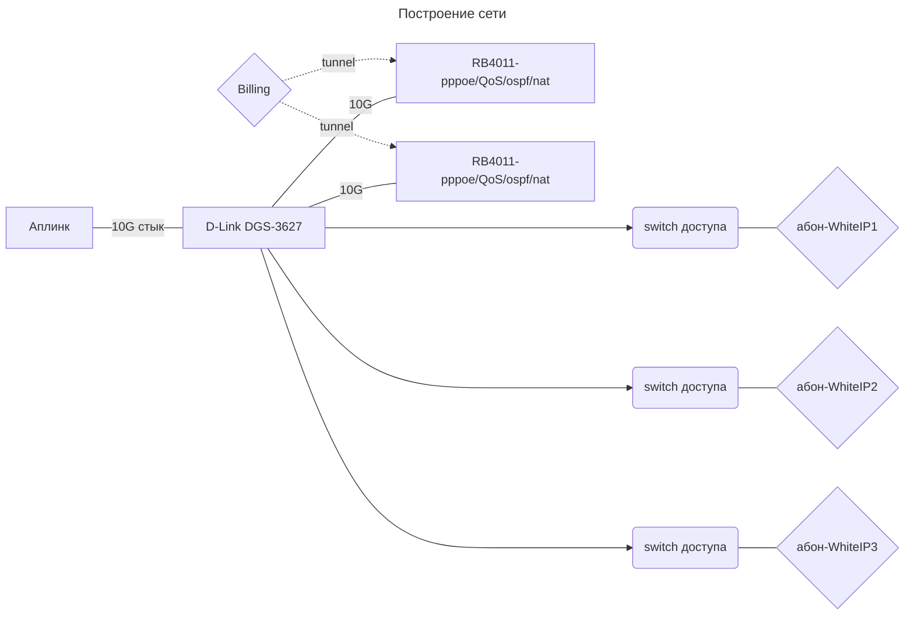

```mermaid
---
title: Построение сети
---
flowchart LR
    
    A[Аплинк] ---|10G стык| L3[D-Link DGS-3627]
    L3 ---|10G| B1[RB4011-pppoe/QoS/ospf/nat]
    L3 ---|10G| B2[RB4011-pppoe/QoS/ospf/nat]
    L3 ---> C2(switch доступа) 
    L3 ---> C3(switch доступа)
    L3 ---> C4(switch доступа)
    
    Bi{Billing} -.-> |tunnel| B1    
    Bi{Billing} -.->|tunnel| B2
    C2 --- A1{абон-WhiteIP1}
    C3 --- A2{абон-WhiteIP2}
    C4 --- A3{абон-WhiteIP3}
```
